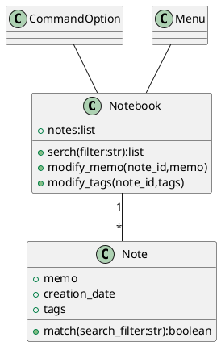

```plantuml

@startuml
class Notebook{
	+notes:list
	+serch(filter:str):list
	+modify_memo(note_id,memo)
	+modify_tags(note_id,tags)
}

class Note{
	+memo
	+creation_date
	+tags
	+match(search_filter:str):boolean
}

CommandOption--Notebook
Menu--Notebook
Notebook"1"--"*"Note


@enduml
```
