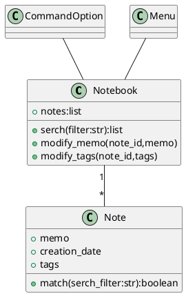

<!--
 * @Author: 560130
 * @Date: 2021-12-26 15:10:32
 * @LastEditTime: 2021-12-26 15:10:48
 * @LastEditors: 560130
 * @Description: 
 * @FilePath: /pythonitem/object-orientedProgrammingPy/chapter2/casestudy.md

